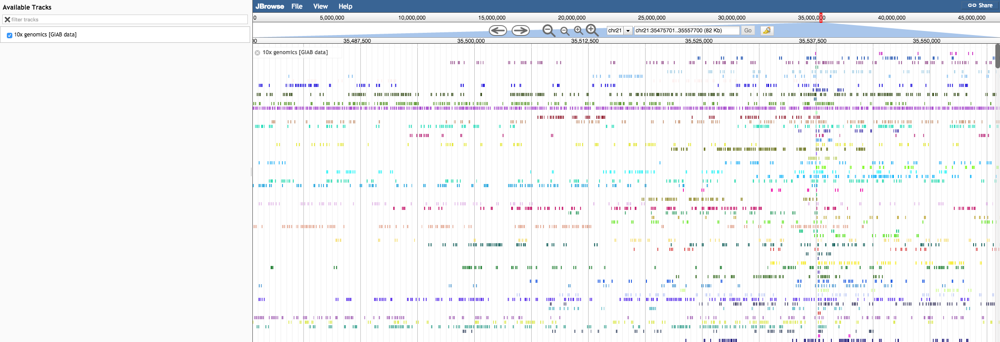

# linkedreadsviewer

A JBrowse plugin that adds some custom glyphs 10x genomics linked reads

## Screenshot

Basic LinkedReadsViewer track

## Install

- Clone repo into plugins folder in JBrowse and name folder LinkedReadsViewer
- Add "plugins": ["LinkedReadsViewer"] to trackList.json or jbrowse_conf.json

## Notes

Experimental! Feel free to provide feedback
